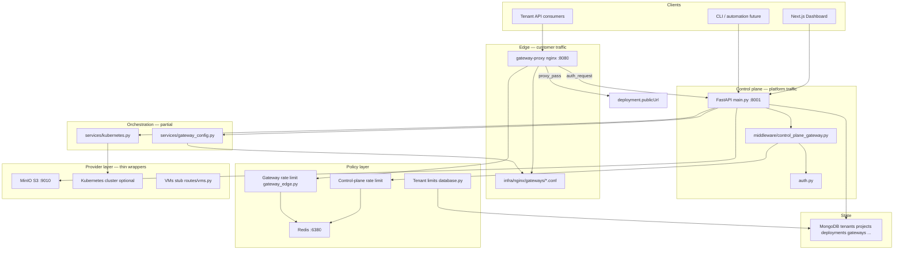
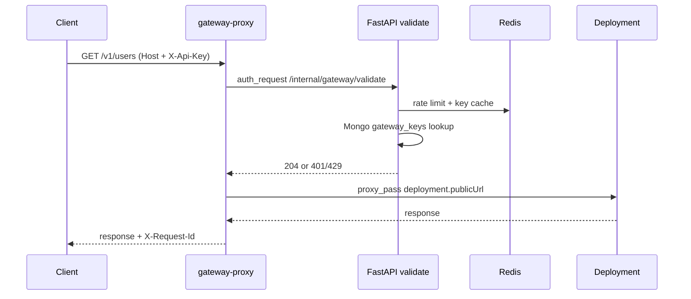

# Cloudlane architecture

Three-layer control plane with **two front doors**: a management API for the dashboard/CLI and a customer API Gateway for tenant app traffic.

## End-to-end view



## Dual front doors

Replace a single “customer-facing API” box with two distinct entry points:

```
┌─────────────────────────────────────────────────────────┐
│  Management plane          │  Data plane (tenant apps) │
│  Dashboard → /api/*        │  Clients → gateway-proxy  │
│  JWT + platform API keys   │  gw_* keys + hostnames    │
└─────────────────────────────────────────────────────────┘
              │                           │
              ▼                           ▼
     Orchestration spine          Route + auth + RL
              │                           │
              └───────────┬───────────────┘
                          ▼
              Provider adapters (K8s, MinIO, …)
```

| Plane | Who | Auth | Entry |
|---|---|---|---|
| **Management** | Dashboard, CLI, automation | JWT or `cl_*` platform API keys | `GET/POST /api/*` on FastAPI |
| **Data (API Gateway)** | Tenant app consumers | `gw_*` consumer keys + gateway hostname | Nginx `gateway-proxy` on `:8080` |

---

## Layer 1 — Control plane API

**Entry:** `apps/api_python/main.py`  
**Auth:** `apps/api_python/auth.py` (JWT + `X-API-Key`)  
**Middleware:** `apps/api_python/middleware/control_plane_gateway.py`

| Capability | Implementation |
|---|---|
| Request IDs | `RequestIdMiddleware` → `X-Request-Id` on every response |
| Rate limiting | `ControlPlaneRateLimitMiddleware` + Redis sliding window |
| Versioning | `ApiVersionMiddleware` rewrites `/api/v1/*` → `/api/*` |

### Routes

| Domain | Prefix | Router | Status |
|---|---|---|---|
| Auth | `/api/auth` | `routes/auth.py` | Live |
| Platform API keys | `/api/api-keys` | `routes/api_keys.py` | Live |
| Deployments | `/api/deployments` | `routes/deployments.py` | Live |
| Projects | `/api/projects` | `routes/projects.py` | Live |
| Object storage | `/api/buckets` | `routes/buckets.py` | Live |
| VMs | `/api/vms` | `routes/vms.py` | Stub |
| API Gateway admin | `/api/gateways` | `routes/gateways.py` | Live |
| Usage metrics | `/api/usage-metrics` | `routes/usage_metrics.py` | Live |
| Billing | `/api/billing` | `routes/billing.py` | Basic |
| Monitoring | `/api/monitoring` | `routes/monitoring.py` | Live |
| Audit logs | `/api/audit-logs` | `routes/audit_logs.py` | Live |
| Health | `/health` | `routes/health.py` | Live |
| GraphQL | — | — | Not built |

**Console UI:** `apps/dashboard/src/app/dashboard/console/page.tsx`  
**Nav / catalog:** `consoleNavMenus.ts`, `consoleServiceCategories.ts`, `ConsoleNav.tsx`  
**Gateway tabs:** `gateway`, `gateway-routes`, `gateway-keys`, `gateway-deploy`

---

## Layer 1b — Customer API Gateway (edge)

Separate from the control plane. Manages tenant HTTP APIs that front Cloud Run-style deployments.

| Component | File | Role |
|---|---|---|
| Gateway CRUD, routes, keys | `routes/gateways.py` | Source of truth in Mongo |
| Nginx config generator | `services/gateway_config.py` | Writes `infra/nginx/gateways/*.conf` on mutation + startup |
| Edge auth + rate limit | `services/gateway_edge.py` | Validates `gw_*` keys, Redis RPM |
| Internal validate endpoint | `routes/gateway_internal.py` | `GET /internal/gateway/validate` for nginx `auth_request` |
| Nginx base config | `infra/nginx/nginx.conf` | Includes gateway confs; upstream to API on host |
| Docker service | `docker-compose.yml` → `gateway-proxy` | Port `8080` |

### Gateway request flow



On success, `gateway_edge.py` records `usage_metrics` with `metricType: gateway_requests`.

### Hostname pattern

Generated on create: `{gateway-slug}-{project-slug}.{GATEWAY_BASE_DOMAIN}`  
Default domain: `gateway.cloudlane.run` (see `GATEWAY_BASE_DOMAIN` in `config.py`).

---

## Layer 2 — Orchestration & multi-tenant isolation

| Concern | Implementation | Status |
|---|---|---|
| Tenant scoping | `tenantId` on all Mongo docs; `database.py` `tenant_clause()` | Live |
| K8s namespace isolation | Per-tenant namespace in `deployments.py` | When `KUBECONFIG` set |
| Kubernetes provisioning | `services/kubernetes.py` — namespace, deployment, service, ingress | Optional |
| Quota | `DEFAULT_TENANT_LIMITS` in `database.py`; deploy count check in `deployments.py` | Partial |
| Rate limiting | `services/redis_client.py` | Live |
| Terraform / IaC | — | Not built |
| Async job queue | — | Not built (deploy is sync in route handler) |

**Models:** `apps/api_python/schemas.py`  
**Persistence:** `apps/api_python/database.py` (mappers, CRUD, `ensure_indexes()`)

### Scopes

Platform keys default to `deploy`, `read`. Gateway admin accepts `gateway:read` / `gateway:write` via `require_scopes()` in `routes/gateways.py`.

---

## Layer 3 — Provider adapters

| Service | Wrapper | Local dev |
|---|---|---|
| S3 / object storage | `services/minio_client.py` | MinIO `:9010`, console `:9011` |
| Kubernetes | `services/kubernetes.py` | Optional; set `KUBECONFIG` |
| VMs (EC2-style) | `routes/vms.py` | Stub only |
| RDS / managed DB | Console stubs | Not built |
| Load balancer | Nginx `gateway-proxy` | Customer API traffic only |
| Deployment ingress | K8s ingress via `kubernetes.py` | When cluster connected |

**Local infra:** `docker-compose.yml` — mongo, minio, redis, prometheus, grafana, gateway-proxy.

Default env (see `apps/api_python/.env.example`):

| Variable | Default |
|---|---|
| `REDIS_URL` | `redis://localhost:6380/0` |
| `MINIO_ENDPOINT` | `localhost:9010` |
| `GATEWAY_BASE_DOMAIN` | `gateway.cloudlane.run` |
| `GATEWAY_CONFIG_DIR` | `infra/nginx/gateways` |

Host ports `6380` / `9010` avoid conflicts when another Redis or MinIO already owns `6379` / `9000`.

---

## MongoDB collections

| Collection | Purpose |
|---|---|
| `tenants`, `users` | Organization + authentication |
| `projects` | Resource grouping |
| `deployments` | Cloud Run-style apps (`publicUrl`, status, K8s refs) |
| `gateways`, `gateway_routes`, `gateway_keys` | API Gateway product |
| `api_keys` | Platform keys for dashboard / CLI (`cl_*`) |
| `buckets` | Object storage metadata |
| `vms` | VM metadata (stub) |
| `usage_metrics` | Metering including `gateway_requests` |
| `invoices` | Billing |
| `audit_logs` | Compliance trail |

---

## Implementation status summary

| Original diagram box | Cloudlane today |
|---|---|
| Customer-facing REST API | FastAPI control plane + gateway admin API |
| Auth + Keys | JWT, platform keys, gateway consumer keys |
| Deployments | CRUD + optional K8s |
| Resources | Projects, buckets, gateways; VMs stub; no RDS |
| Usage / Bills | Metrics + basic billing |
| Terraform / IaC | Missing |
| Quota manager | Partial (tenant limits, deploy count) |
| Rate limiter | Redis on control plane + gateway edge |
| EC2 / VMs | API stub |
| K8s | Real when cluster configured |
| S3 | MinIO |
| Load balancer | Gateway proxy only (not general LB product) |

---

## Recommended build order

1. **Async orchestrator** — deployment state machine (`provisioning` → `running` → `failed`); worker outside the request path.
2. **Quota service** — enforce CPU, memory, and storage limits consistently, not only deploy count.
3. **Provider driver interface** — `Provisioner.create_deployment()`, `create_bucket()`, etc., instead of inline K8s/MinIO calls in route handlers.
4. **General load balancer product** — separate from API Gateway if L4/L7 for VMs/K8s is needed.
5. **RDS / GraphQL** — after Layer 2 is solid.

---

## Related docs

- [DEPLOYMENT.md](./DEPLOYMENT.md) — Vercel dashboard + Netlify API hosting
- [README.md](../README.md) — project overview and quick start
