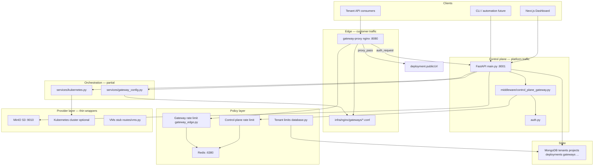
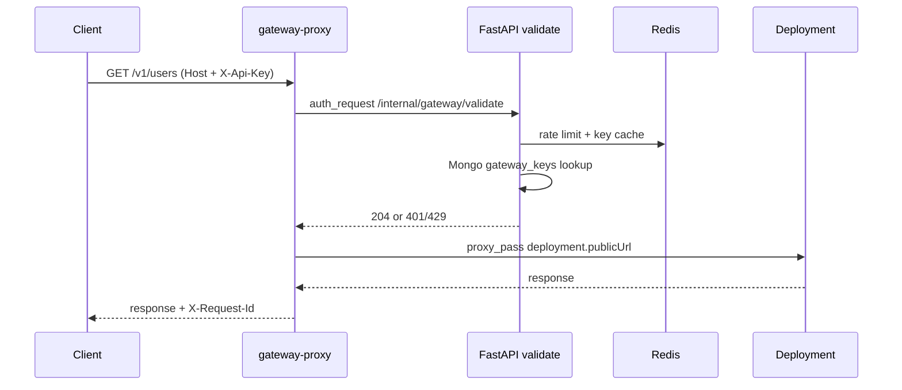

# Cloudlane architecture

Three-layer control plane with **two front doors**: a management API for the dashboard/CLI and a customer API Gateway for tenant app traffic.

## End-to-end view



## Dual front doors

Replace a single “customer-facing API” box with two distinct entry points:

```
┌─────────────────────────────────────────────────────────┐
│  Management plane          │  Data plane (tenant apps) │
│  Dashboard → /api/*        │  Clients → gateway-proxy  │
│  JWT + platform API keys   │  gw_* keys + hostnames    │
└─────────────────────────────────────────────────────────┘
              │                           │
              ▼                           ▼
     Orchestration spine          Route + auth + RL
              │                           │
              └───────────┬───────────────┘
                          ▼
              Provider adapters (K8s, MinIO, …)
```

| Plane | Who | Auth | Entry |
|---|---|---|---|
| **Management** | Dashboard, CLI, automation | JWT or `cl_*` platform API keys | `GET/POST /api/*` on FastAPI |
| **Data (API Gateway)** | Tenant app consumers | `gw_*` consumer keys + gateway hostname | Nginx `gateway-proxy` on `:8080` |

---

## Layer 1 — Control plane API

**Entry:** `apps/api_python/main.py`  
**Auth:** `apps/api_python/auth.py` (JWT + `X-API-Key`)  
**Middleware:** `apps/api_python/middleware/control_plane_gateway.py`

| Capability | Implementation |
|---|---|
| Request IDs | `RequestIdMiddleware` → `X-Request-Id` on every response |
| Rate limiting | `ControlPlaneRateLimitMiddleware` + Redis sliding window |
| Versioning | `ApiVersionMiddleware` rewrites `/api/v1/*` → `/api/*` |

### Routes

| Domain | Prefix | Router | Status |
|---|---|---|---|
| Auth | `/api/auth` | `routes/auth.py` | Live |
| Platform API keys | `/api/api-keys` | `routes/api_keys.py` | Live |
| Deployments | `/api/deployments` | `routes/deployments.py` | Live |
| Projects | `/api/projects` | `routes/projects.py` | Live |
| Object storage | `/api/buckets` | `routes/buckets.py` | Live |
| GraphQL | `/graphql` | `routes/graphql.py` | Live (read subset) |
| Secrets | `/api/secrets` | `routes/secrets.py` | Live |
| Load balancers | `/api/load-balancers` | `routes/load_balancers.py` | Live (HTTP/HTTPS/TCP on gateway-proxy) |
| Managed DBs | `/api/databases` | `routes/databases.py` | Live (real Postgres/MySQL on compose) |
| VMs | `/api/vms` | `routes/vms.py` | Stub |
| API Gateway admin | `/api/gateways` | `routes/gateways.py` | Live |
| Usage metrics | `/api/usage-metrics` | `routes/usage_metrics.py` | Live |
| Billing | `/api/billing` | `routes/billing.py` | Live (IremboPay invoice + webhook) |
| Monitoring | `/api/monitoring` | `routes/monitoring.py` | Live |
| Audit logs | `/api/audit-logs` | `routes/audit_logs.py` | Live |
| Health | `/health` | `routes/health.py` | Live |
| GraphQL | — | — | Not built |

**Console UI:** `apps/dashboard/src/app/dashboard/console/page.tsx`  
**Nav / catalog:** `consoleNavMenus.ts`, `consoleServiceCategories.ts`, `ConsoleNav.tsx`  
**Gateway tabs:** `gateway`, `gateway-routes`, `gateway-keys`, `gateway-deploy`

---

## Layer 1b — Customer API Gateway (edge)

Separate from the control plane. Manages tenant HTTP APIs that front Cloud Run-style deployments.

| Component | File | Role |
|---|---|---|
| Gateway CRUD, routes, keys | `routes/gateways.py` | Source of truth in Mongo |
| Nginx config generator | `services/gateway_config.py` | Writes `infra/nginx/gateways/*.conf` on mutation + startup |
| Edge auth + rate limit | `services/gateway_edge.py` | Validates `gw_*` keys, Redis RPM |
| Internal validate endpoint | `routes/gateway_internal.py` | `GET /internal/gateway/validate` for nginx `auth_request` |
| Nginx base config | `infra/nginx/nginx.conf` | Includes gateway confs; upstream to API on host |
| Docker service | `docker-compose.yml` → `gateway-proxy` | Port `8080` |

### Gateway request flow



On success, `gateway_edge.py` records `usage_metrics` with `metricType: gateway_requests`.

### Hostname pattern

Generated on create: `{gateway-slug}-{project-slug}.{GATEWAY_BASE_DOMAIN}`  
Default domain: `gateway.cloudlane.run` (see `GATEWAY_BASE_DOMAIN` in `config.py`).

---

## Layer 2 — Orchestration & multi-tenant isolation

| Concern | Implementation | Status |
|---|---|---|
| Tenant scoping | `tenantId` on all Mongo docs; `database.py` `tenant_clause()` | Live |
| K8s namespace isolation | Per-tenant namespace in `deployments.py` | When `KUBECONFIG` set |
| Kubernetes provisioning | `services/kubernetes.py` — namespace, deployment, service, ingress, KEDA ScaledObject | Optional |
| Async provision worker | `worker.py`, `services/provision_worker.py`, `provision_jobs` collection | Live |
| Quota | `services/quota.py` — CPU×maxInstances, memory, deploy count, buckets; `GET /api/quota` | Live |
| Rate limiting | `services/redis_client.py` | Live |
| Terraform / IaC | — | Not built |
| Async job queue | — | Implemented via `provision_jobs` |
| Provider drivers | `services/providers/` — `ComputeProvider`, `ObjectStorageProvider` | Live |

**Models:** `apps/api_python/schemas.py`  
**Persistence:** `apps/api_python/database.py` (mappers, CRUD, `ensure_indexes()`)

### Scopes

Platform keys default to `deploy`, `read`. Gateway admin accepts `gateway:read` / `gateway:write` via `require_scopes()` in `routes/gateways.py`.

---

## Layer 3 — Provider adapters

| Service | Wrapper | Local dev |
|---|---|---|
| S3 / object storage | `services/providers/minio.py` → `minio_client.py` | MinIO `:9010`, console `:9011` |
| Kubernetes | `services/providers/k8s.py` → `kubernetes.py` | Optional; set `KUBECONFIG` |
| Secret vault | `services/providers/secrets.py` (Fernet) | Encrypted in Mongo `secrets` |
| Load balancer | `services/providers/load_balancer.py` + `services/lb_config.py` | HTTP/HTTPS L7 + TCP L4 on `gateway-proxy`; DNS `*.lb.cloudlane.run` |
| Managed DB | `services/providers/database.py` | Real DBs on `managed-postgres` (:5433) / `managed-mysql` (:3307); per-tenant DB+user |
| VMs (EC2-style) | `routes/vms.py` | Stub only |
| RDS / managed DB | Console `sql-instances` + `/api/databases` | Live local data-plane |
| Load balancer | Console Load Balancing + `/api/load-balancers` | Live L7 (Host → `:8080`) |
| Deployment ingress | K8s ingress via compute provider | When cluster connected |

**Local infra:** `docker-compose.yml` — mongo, minio, redis, prometheus, grafana, gateway-proxy.

Default env (see `apps/api_python/.env.example`):

| Variable | Default |
|---|---|
| `REDIS_URL` | `redis://localhost:6380/0` |
| `MINIO_ENDPOINT` | `localhost:9010` |
| `GATEWAY_BASE_DOMAIN` | `gateway.cloudlane.run` |
| `GATEWAY_CONFIG_DIR` | `infra/nginx/gateways` |
| `LB_BASE_DOMAIN` | `lb.cloudlane.run` |
| `LB_CONFIG_DIR` | `infra/nginx/lbs` |
| `MANAGED_POSTGRES_PORT` | `5433` |
| `MANAGED_MYSQL_PORT` | `3307` |

Host ports `6380` / `9010` avoid conflicts when another Redis or MinIO already owns `6379` / `9000`.

---

## MongoDB collections

| Collection | Purpose |
|---|---|
| `tenants`, `users` | Organization + authentication |
| `projects` | Resource grouping |
| `deployments` | Cloud Run-style apps (`publicUrl`, status, K8s refs) |
| `gateways`, `gateway_routes`, `gateway_keys` | API Gateway product |
| `secrets` | Encrypted tenant secrets (Secret Manager) |
| `load_balancers` | General LB product; HTTP/HTTPS synced to `infra/nginx/lbs` |
| `database_instances` | Managed SQL product (real PG/MySQL; conn string Fernet-encrypted) |
| `api_keys` | Platform keys for dashboard / CLI (`cl_*`) |
| `buckets` | Object storage metadata |
| `vms` | VM metadata (stub) |
| `usage_metrics` | Metering including `gateway_requests` |
| `invoices` | Billing |
| `audit_logs` | Compliance trail |

---

## Implementation status summary

| Original diagram box | Cloudlane today |
|---|---|
| Customer-facing REST API | FastAPI control plane + gateway admin API |
| Auth + Keys | JWT, platform keys, gateway consumer keys |
| Deployments | CRUD + optional K8s |
| Resources | Projects, buckets, gateways; VMs stub; managed SQL on compose |
| Usage / Bills | Metrics + basic billing |
| Terraform / IaC | Missing |
| Async job queue | Mongo `provision_jobs` + `provision-worker` container |
| Quota manager | Live — CPU/memory at max scale, deploy count, buckets/secrets/LBs/DBs; console Hub Quotas |
| Rate limiter | Redis on control plane + gateway edge |
| Provider drivers | `services/providers` — K8s, MinIO, secrets, LB L7 nginx, managed SQL |
| EC2 / VMs | API stub |
| K8s | Real when cluster configured |
| S3 | MinIO |
| Load balancer | HTTP/HTTPS L7 + TCP L4 on gateway-proxy (`infra/nginx/lbs`, `lb-stream`); API Gateway remains for keyed APIs |
| Secret vaults | Live — Fernet-encrypted tenant secrets |
| RDS | Live locally — shared Postgres/MySQL engines, isolated DB+user per instance |
| GraphQL | Live thin read API at `/graphql` |

---

## Recommended build order

1. ~~**Async orchestrator**~~ — done (`provision_jobs` + worker; deploy returns 202)
2. ~~**Quota service**~~ — done (`services/quota.py`, `/api/quota`, console Hub Quotas)
3. ~~**Provider driver interface**~~ — done (`services/providers/` for compute + object storage)
4. ~~**General load balancer product**~~ — done (`/api/load-balancers`, console Load Balancing; HTTP L7 on gateway-proxy)
5. ~~**RDS / GraphQL**~~ — done (real managed Postgres/MySQL on compose + `/graphql` read API)
6. ~~**Secret Vaults**~~ — done (tenant `/api/secrets` + ops `/api/ops/secrets` Cloudlane secret migration)

### Still open

- Per-instance SQL containers / disk quotas / automated backups (beyond shared engines)
- Full GraphQL schema (current `/graphql` is a thin query selector)

### Load balancer L4 / TLS

Done: HTTP L7 on `:8080`, HTTPS TLS terminate on `:8443` (auto self-signed dev certs), TCP L4 via nginx `stream` on `:19400–19599`. See [docs/LB.md](LB.md).

### IremboPay production charges

Done: `POST /payments/invoices` on generate, `paymentLinkUrl` on invoice, webhook at `/api/billing/irembopay/webhook`, sync endpoint. See [docs/IREMBOPAY.md](IREMBOPAY.md).

### KEDA scale-to-zero

Done when cluster has KEDA installed: provision creates `ScaledObject` (CPU, min↔max). `minInstances: 0` is kept (no longer forced to 1). Optional `HTTPScaledObject` when `KEDA_HTTP_ADDON_ENABLED=true`. See [docs/KEDA.md](KEDA.md).

### Ops vault (Cloudlane secret migration)

Done: control-plane secrets can move from `.env` into encrypted Mongo `system_secrets`.

| Stays in env (bootstrap) | Migratable via `/api/ops/secrets` |
|---|---|
| `DATABASE_URL` | `JWT_SECRET` |
| `SECRETS_MASTER_KEY` (Fernet root) | `MINIO_ACCESS_KEY`, `MINIO_SECRET_KEY` |
| | `REDIS_URL`, `IREMBOPAY_API_KEY` |

- `POST /api/ops/secrets/migrate` — copy current settings into vault (admin)
- Startup applies vault overlays via `apply_ops_secrets_to_runtime()`
- Console: **Cloudlane Secrets Manager** → Control plane panel

---

## Data encryption (in transit + at rest)

Maps the platform encryption diagram to Cloudlane’s actual hosts:

```
User
  │  TLS 1.3 (browser)
  ▼
Cloudflare / Vercel / Netlify edge   ← diagram: Cloudflare edge (TLS 1.3, origin cert)
  │  HTTPS to origin
  ▼
Control plane (FastAPI on Netlify)   ← diagram: ALB + AWS service
  │  HSTS + security headers (SecurityHeadersMiddleware)
  │  TLS 1.3 to Atlas (mongodb+srv / tls=true)
  ▼
MongoDB Atlas                        ← diagram: MongoDB
```

| Layer | Cloudlane | Status |
|---|---|---|
| Edge TLS | Vercel dashboard + Netlify API (platform TLS) | Live (host) |
| Origin hardening | `SecurityHeadersMiddleware` — HSTS when HTTPS / production | Live |
| Service → DB | `ensure_mongo_tls_params` + prod requires TLS | Live |
| At rest (secrets) | Fernet tenant + ops vaults | Live |
| At rest (passwords) | bcrypt | Live |
| At rest (API keys) | SHA-256 hashes | Live |

Check posture: `GET /health/encryption`

Local docker Mongo may stay plaintext (`localhost`). Production / Netlify requires Atlas TLS.

---

## Related docs

- [DEPLOYMENT.md](./DEPLOYMENT.md) — Vercel dashboard + Netlify API hosting
- [README.md](../README.md) — project overview and quick start
